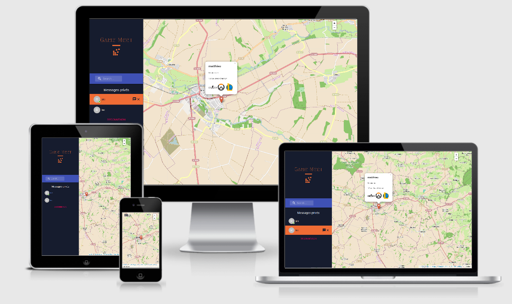

# Game Meet

      

# Side Project
## Site to search and talk with players near you

### Technology Front-End

* React
* React-Router
* Redux
* Material-UI
* TypeScript
* React-Leaflet
* React-spring
* Moment
* CssinJS

### Technology Back-End

* Firebase
* Api: mapquestapi

### Features

* Authentication
* Geolocation
* Add / Delete Friends
* Send Messages
